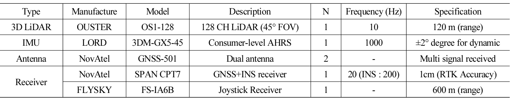
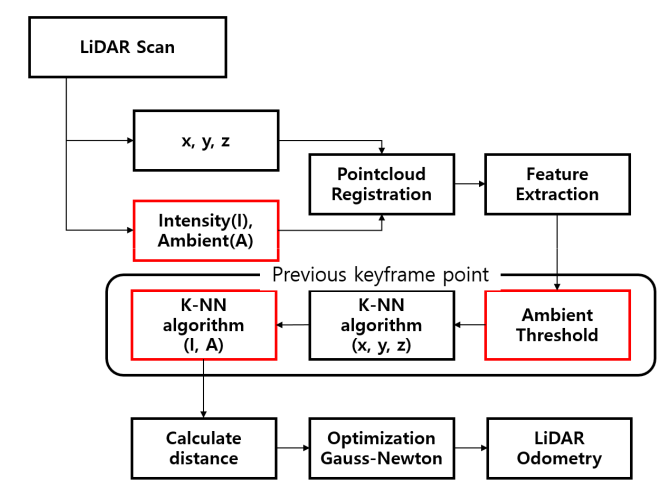
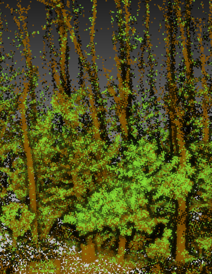
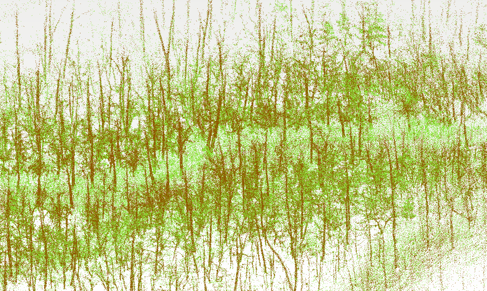
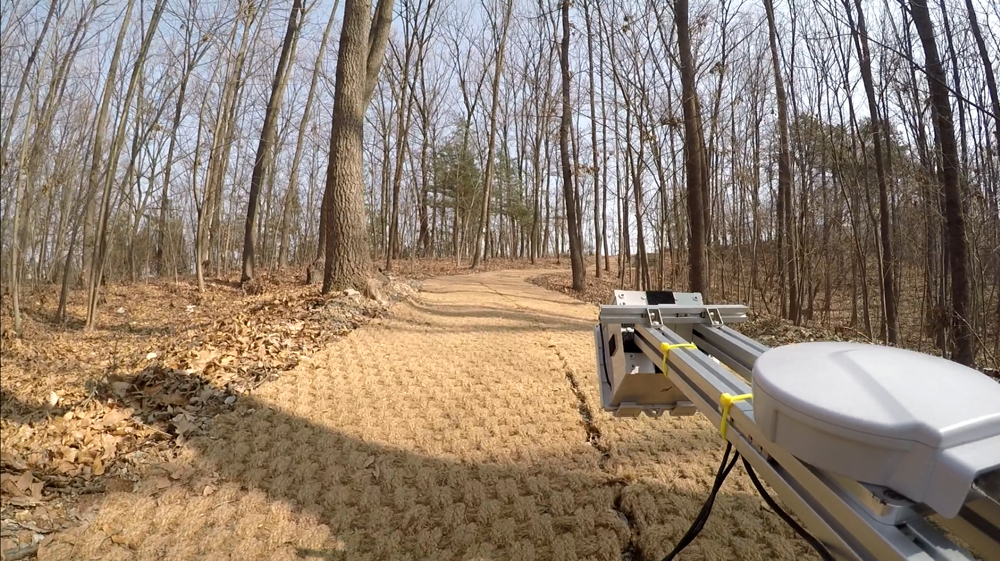
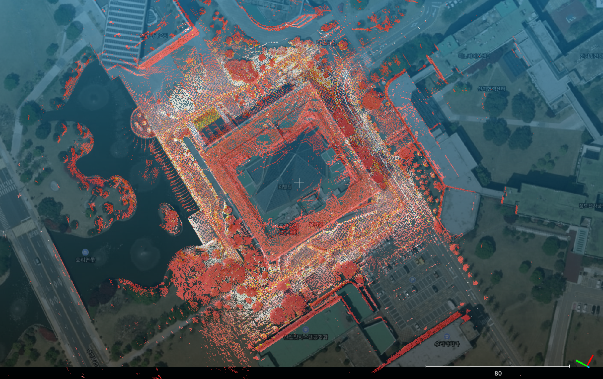
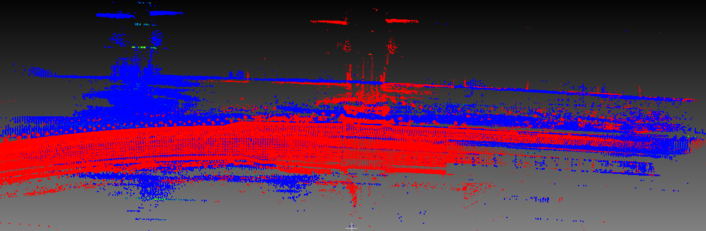
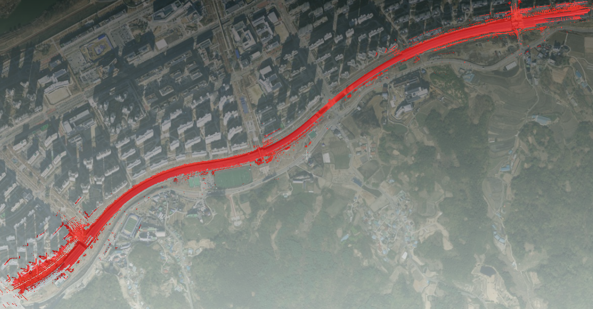
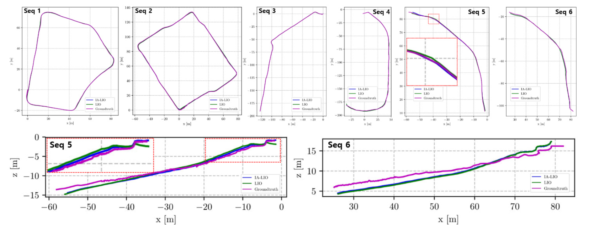

# IA-LIO-SAM

**Construction monitoring is one of the key modules in smart construction. Unlike structured urban environment, construction site mapping is challenging due to the characteristics of an unstructured environment. For example, irregular feature points and matching prohibit creating a map for management. To tackle this issue, we propose a system for data acquisition in unstructured environment and a framework for Intensity and Ambient Enhanced Lidar Inertial Odometry via Smoothing and Mapping, IA-LIO-SAM, that achieves highly accurate robot trajectories and mapping. IA-LIO-SAM utilizes a factor graph same as Tightly-coupled Lidar Inertial Odometry via Smoothing and Mapping (LIO-SAM). Enhancing the existing LIO-SAM, IA-LIO-SAM leverages point’s intensity and ambient value to remove unnecessary feature points. These additional values also perform as a new factor of the K-Nearest Neighbor algorithm (KNN), allowing accurate comparisons between stored points and scanned points. The performance was verified in three different environments and compared with LIO-SAM.**

## System architecture(Hardware, Software)

<p align='center'>
    
</p>
<p align='center'>
    
    
</p>

It uses the code of LIO-SAM, but there are two differences. 
- In ImageProjection.cpp, give the point an ambient value (ambient is given to the curvature channel). 
- Add nearest search using ambient in Optimization.cpp.(there are new parameters, ambientThreshold, numFirstNeighbor, numSecondNeighbor in params.yaml)

## Dependency

- [ROS](http://wiki.ros.org/ROS/Installation) (tested with Kinetic and Melodic)
  ```
  sudo apt-get install -y ros-kinetic-navigation
  sudo apt-get install -y ros-kinetic-robot-localization
  sudo apt-get install -y ros-kinetic-robot-state-publisher
  ```
- [gtsam](https://github.com/borglab/gtsam/releases) (Georgia Tech Smoothing and Mapping library)
  ```
  wget -O ~/Downloads/gtsam.zip https://github.com/borglab/gtsam/archive/4.0.2.zip
  cd ~/Downloads/ && unzip gtsam.zip -d ~/Downloads/
  cd ~/Downloads/gtsam-4.0.2/
  mkdir build && cd build
  cmake -DGTSAM_BUILD_WITH_MARCH_NATIVE=OFF ..
  sudo make install -j8
  ```
Also, for IA-LIO-SAM to work, your data needs to work well with LIO-SAM. We recommend that you test whether it works well with LIO-SAM first. (https://github.com/TixiaoShan/LIO-SAM)

## Install

Use the following commands to download and compile the package.

```
cd ~/catkin_ws/src
git clone https://github.com/minwoo0611/IA_LIO_SAM
cd ..
catkin_make
```

## Sample dataset images

  * You can see the image with different ambient value(brown is low, green is high) and tree map from IA-LIO-SAM. Also, The surrounding environment is shown in the picture below.
<p align='center'>
    
    
    
</p>

* It works in urban environments as well as unstructured environments, and performance may be good or bad depending on the situation. In the first picture, Seq 2, you can see that the mapped points match well with the real environment. In the case of the seoncd picture, it is the result of mapping the urban tunnel. Blue and red show the mapping results of LIO-SAM and IA-LIO-SAM, respectively, and if you look at the third picture, you can see that IA-LIO-SAM matches well with the real environment. In an object with a similar structure, the lidar odometry factor may not be accurate when searching for a location using only x, y, and z. However, accurate values ​​can be obtained if intensity and ambient are additionally used.
<p align='center'>
    
    
    
</p>

* These images are results of my paper. more images can be seen in my paper(./config/doc/KRS-2021-17.pdf).
<p align='center'>
    
</p>
## Run the package

1. Run the launch file:
```
roslaunch lio_sam run.launch
```

2. Play existing bag files:
```
rosbag play your-bag.bag -r 3
```

## Service
  - /lio_sam/save_map
    - save map as a PCD file.
      ``` bash
        rosservice call [service] [resolution] [destination]
      ```
      - Example:
      ``` bash
        $ rosservice call /lio_sam/save_map 0.2 "/Downloads/LOAM/"
      ```

## Paper 

Thank you for citing IA-LIO-SAM(./config/doc/KRS-2021-17.pdf) if you use any of this code. 


```
TODO
```

Part of the code is adapted from [LIO-SAM (IROS-2020)](https://github.com/TixiaoShan/LIO-SAM).
```
@inproceedings{legoloam2018shan,
  title={LeGO-LOAM: Lightweight and Ground-Optimized Lidar Odometry and Mapping on Variable Terrain},
  author={Shan, Tixiao and Englot, Brendan},
  booktitle={IEEE/RSJ International Conference on Intelligent Robots and Systems (IROS)},
  pages={4758-4765},
  year={2018},
  organization={IEEE}
}
```

## Acknowledgement

  - IA-LIO-SAM is based on LIO-SAM (T. Shan, B. Englot, D. Meyers, W. Wang, C. Ratti, and D. Rus. LIO-SAM: Tightly-coupled Lidar Inertial Odometry via Smoothing and Mapping).
